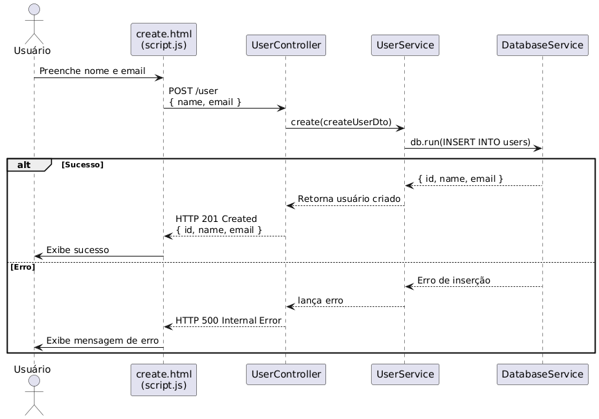
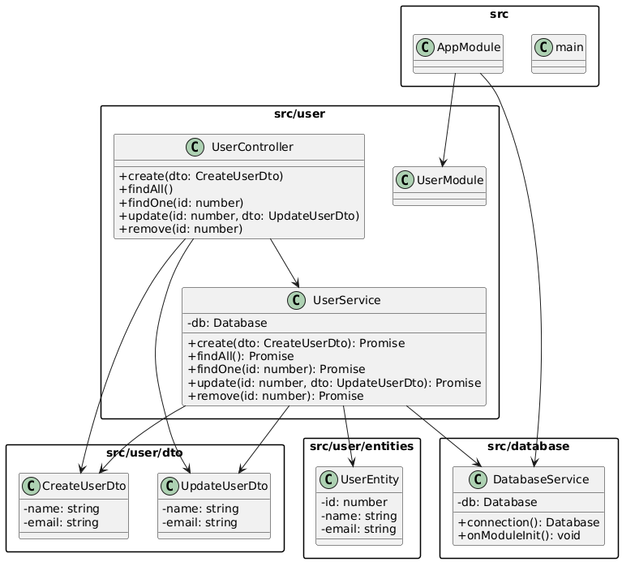

## 📘 Projeto: API com Frontend e Backend em NestJS

Este projeto tem como objetivo demonstrar a criação de uma aplicação completa utilizando o **NestJS**, um framework progressivo para Node.js. Ele combina a robustez de um backend estruturado com TypeScript e a simplicidade de um frontend em HTML, CSS e JavaScript puro.

A proposta é desenvolver uma **API RESTful** com NestJS e integrar com um **frontend estático**, possibilitando a realização de operações básicas de **cadastro, listagem, atualização e remoção de usuários**.

---

### 🧰 Tecnologias utilizadas

- **NestJS** (backend)
- **SQLite** (banco de dados com sqlte, sem ORM)
- **HTML/CSS/JavaScript** (frontend estático)
- **Node.js** e **npm**

---

### 📌 Funcionalidades

- Criar usuários via formulário (POST)
- Listar usuários em tempo real (GET)
- Atualizar e excluir registros via API
- Servir páginas HTML diretamente do servidor NestJS

---

### 🚀 Objetivo Educacional

Este projeto serve como base para aprender conceitos fundamentais como:

- Arquitetura modular com NestJS
- Integração de frontend simples com API
- Persistência de dados com SQLite (sem ORM)
- Injeção de dependência e modularização
- Uso de DTOs para organização de dados

---

Para instalar as dependências e subir o servidor, segue:

### 📥 Clonando o projeto via GitHub

Para baixar e executar este projeto em sua máquina local:

```bash
# Clone o repositório
git clone https://github.com/seu-usuario/seu-repositorio.git

# Acesse a pasta do projeto
cd seu-repositorio

# Instale o Nest de forma global
npm i -g @nestjs/cli

# Instale as dependências
npm install

# Inicie o projeto em modo de desenvolvimento
npm run start:dev
```

> 🔁 Substitua `seu-usuario/seu-repositorio` pela URL real do seu repositório no GitHub.

---

### 🌐 Acessando o projeto

- Acesse o frontend: [http://localhost:3000/index.html](http://localhost:3000/index.html)
- API disponível em: [http://localhost:3000/user](http://localhost:3000/user)

---

Comecçando o projeto do zero:

# Tutorial passo a passo do Projeto: API com Frontend e Backend em NestJS

---

## ✅ Pré-requisitos

Antes de começar, você precisa ter instalado:

1. **Node.js** (versão LTS)
   👉 Baixe em: [https://nodejs.org](https://nodejs.org)
   Verifique no terminal:

   ```bash
   node -v
   npm -v
   ```

2. **npm** (vem com o Node.js) ou **yarn**

3. **Nest CLI** (Interface de linha de comando do NestJS):
   Instale com:

   ```bash
   npm i -g @nestjs/cli
   ```

4. **Visual Studio Code** instalado
   👉 [https://code.visualstudio.com/](https://code.visualstudio.com/)

---

# Projeto de Sofwtare com Engenharia:

## Arquitetura em camadas (Layered Architecture): Arquitetura em camadas modularizada

O NestJS adota nativamente uma arquitetura em camadas modularizada, inspirada no padrão Clean Architecture (ou Onion, Hexagonal), com forte influência de DDD (Domain-Driven Design).

Arquitetura adotada:

Arquitetura padrão do NestJS geralmente possui 4 camadas principais, mas o número pode variar conforme a complexidade do projeto.
Inclui neste projeto a camada de apresentação, ficando assim uma arquitetura de 5 camadas, também chamada de N camadas.


Camadas (Layered Architecture) com separação clara entre:

1. Interface de Usuário (Frontend): Representa a interface que o usuário interage (HTML + JS).
2. Interface de Entrada / Apresentação (Controller): Camada de Controllers no NestJS.Responsável por receber requisições HTTP e chamar os serviços.
3. Aplicação / Serviço (Service):Onde ficam as regras de negócio específicas da aplicação
4. Domínio (Entidades): Regras centrais do negócio e modelo de dados
5. Infraestrutura (Database): Contém o acesso a banco de dados, integrações, APIs externas etc.

O arquivo user.entity.ts representa a entidade de domínio, ou seja, a forma central como seu sistema entende um "usuário". A presença dele mostra que você está se aproximando de Clean Architecture, DDD ou Onion Architecture.

O projeto segue uma arquitetura em camadas, inspirada na Clean Architecture:

- Controller: Interface de entrada, recebe e repassa dados.
- Service: Contém regras de negócio específicas da aplicação.
- Entities: Representam o modelo de domínio
- DTOs: contratos de entrada.
- DatabaseService: Responsável pela persistência (infraestrutura).

  Essa organização facilita o desacoplamento, modularidade e testes.


## Diagrama Arquitetural

O Diagrama Arquitetural serve para representar visualmente a estrutura de um sistema de software, mostrando como seus componentes principais se organizam, interagem e se comunicam entre si.


# Módulo Usuário:

## Diagrama de Atividade

O Diagrama de Atividade serve para representar visualmente o fluxo de execução de um processo ou funcionalidade, mostrando as etapas, decisões, e caminhos alternativos que podem ocorrer.

## Diagrama de Atividade - Registrar usuário

Descrevendo todas as etapas que ocorrem no fluxo de cadastro de um usuário


## Diagrama de Sequência

O Diagrama de Sequência é um tipo de diagrama da UML (Linguagem de Modelagem Unificada) usado para modelar o comportamento dinâmico de um sistema, mostrando como os objetos interagem entre si ao longo do tempo para realizar uma tarefa ou processo.

## Diagrama de Sequência - Registrar usuário

Diagrama mostra o passo a passo do processo de cadastro de um usuário no sistema



## Diagrama de Classe

O Diagrama de Classes serve para representar a estrutura estática do sistema, mostrando suas classes, atributos, métodos e os relacionamentos entre elas.



# Módulo Database:


## 🚀 Criando o Projeto do Zero

Vamos agora iniciar um projeto do zero para conhecermos o NestJs e seu poder...

1. **Abra o terminal no VS Code** ou terminal do sistema.

2. Execute o comando para criar o projeto:

   ```bash
   nest new nome-do-projeto
   ```

   Exemplo:

   ```bash
   nest new recording
   ```

3. **Escolha o gerenciador de pacotes** (`npm` ou `yarn`) quando solicitado.

4. O NestJS criará a estrutura básica do projeto com os seguintes diretórios:

   ```
   src/
   ├── app.controller.spec.ts
   ├── app.controller.ts
   ├── app.module.ts
   ├── app.service.ts
   └── main.ts
   ```

---

main.ts Esse código é o ponto de entrada principal de uma aplicação NestJS

## ▶️ Rodando o Projeto

Entre na pasta do projeto:

```bash
cd recording
```

Execute o projeto com:

```bash
npm run start:dev
```

> O servidor estará rodando em `http://localhost:3000`

---

## 🧪 Testando no Navegador ou Postman

Abra `http://localhost:3000` no navegador.
Você verá:

```
Hello World!
```

---

## 🧩 Dica: Extensões Úteis no VS Code

- **ESLint** – para boas práticas de código
- **Prettier** – para formatação automática
- **NestJS Snippets** – autocompletar para NestJS

---

## 📦 Estrutura típica do NestJS

```
src/
├── main.ts
├── app.module.ts
├── app.controller.ts
├── app.service.ts
```

# main.ts

Esse código é o **ponto de entrada principal** de uma aplicação NestJS — normalmente está no arquivo `main.ts`. Vamos analisar linha por linha:

---

### 📦 Código

```ts
import { NestFactory } from '@nestjs/core';
import { AppModule } from './app.module';
```

- **`NestFactory`**: É uma classe do NestJS usada para **criar uma instância da aplicação Nest**.
- **`AppModule`**: É o **módulo raiz** da aplicação — onde os controladores, serviços e outros módulos são registrados.

---

### 🚀 Função `bootstrap()`

```ts
async function bootstrap() {
  const app = await NestFactory.create(AppModule);
  await app.listen(process.env.PORT ?? 3000);
}
```

- **`bootstrap()`**: Função que **inicializa a aplicação**.
- `NestFactory.create(AppModule)`: Cria a aplicação Nest usando o módulo principal.
- `app.listen(...)`: Coloca o servidor para escutar requisições HTTP na porta especificada.

A linha:

```ts
await app.listen(process.env.PORT ?? 3000);
```

- Verifica se existe uma variável de ambiente chamada `PORT` (útil para ambientes de produção como Heroku).
- Se não houver, usa a **porta padrão 3000**.

---

### 🏁 E por fim:

```ts
bootstrap();
```

- **Chama a função `bootstrap()`** para rodar o servidor.

---

### 🧠 Em resumo:

Esse código:

✅ Cria a aplicação Nest
✅ Usa o `AppModule` como módulo principal
✅ Inicializa o servidor HTTP
✅ Escuta na porta definida

---

# app.module.ts

Esse código define o **módulo principal** da aplicação NestJS, chamado `AppModule`.

Vamos entender **parte por parte**:

---

### 📦 Código completo

```ts
import { Module } from '@nestjs/common';
import { AppController } from './app.controller';
import { AppService } from './app.service';

@Module({
  imports: [],
  controllers: [AppController],
  providers: [AppService],
})
export class AppModule {}
```

---

## 🧩 Explicando passo a passo

### 🔹 `import { Module } from '@nestjs/common';`

- Importa o **decorador `@Module()`**, que é usado para definir um **módulo NestJS**.

### 🔹 `AppController` e `AppService`

- **`AppController`**: Controlador responsável por lidar com as requisições HTTP (como rotas GET, POST etc).
- **`AppService`**: Serviço responsável pela **lógica de negócio**, chamado dentro do controller.

---

### 🔹 Decorador `@Module({ ... })`

Esse decorador define as **dependências e estruturas** que o módulo usará:

```ts
@Module({
  imports: [], // Outros módulos que esse módulo depende
  controllers: [AppController], // Controladores que lidam com requisições
  providers: [AppService], // Serviços e injeções de dependência
})
```

- **`imports`**: Lista de módulos que esse módulo importa (ex: `TypeOrmModule`, `HttpModule`, etc).
- **`controllers`**: Define quais controladores fazem parte deste módulo.
- **`providers`**: Define os **serviços (e outras classes)** que serão injetáveis (injeção de dependência).

---

## 🧠 Em resumo:

A classe `AppModule`:

✅ Organiza a estrutura do projeto
✅ Conecta controladores e serviços
✅ É o **módulo raiz**, ou seja, o ponto inicial da organização da aplicação

> Tudo no NestJS gira em torno de **módulos**, e `AppModule` é o primeiro deles.

---

# app.controller.ts

Esse código define um **controller no NestJS**, que é responsável por lidar com requisições HTTP — como se fosse o "porta-voz" entre o mundo externo (navegador, Postman, etc) e a lógica interna da aplicação.

---

## 📦 Código analisado

```ts
import { Controller, Get } from '@nestjs/common';
import { AppService } from './app.service';

@Controller()
export class AppController {
  constructor(private readonly appService: AppService) {}

  @Get()
  getHello(): string {
    return this.appService.getHello();
  }
}
```

---

## 🧩 Explicação linha por linha

### 🔹 `import { Controller, Get } from '@nestjs/common';`

- `Controller`: Decorador que marca a classe como um **controlador HTTP**.
- `Get`: Decorador que define um **endpoint HTTP GET**.

---

### 🔹 `@Controller()`

- Define que essa classe vai **responder a requisições HTTP**.
- O parâmetro vazio (`@Controller()`) indica que a **rota base** é `/`.

> Se fosse `@Controller('usuarios')`, o endpoint responderia a `/usuarios`.

---

### 🔹 `constructor(private readonly appService: AppService)`

- O Nest injeta automaticamente o `AppService` aqui.
- Isso é **injeção de dependência** — o controller pode usar os métodos do serviço sem precisar criá-lo manualmente.

---

### 🔹 `@Get()`

- Define que o método abaixo vai responder a **requisições HTTP GET** na **rota base `/`**.

---

### 🔹 `getHello()`

- É o **método que responde à requisição**.
- Ele chama `this.appService.getHello()` — ou seja, delega a resposta ao serviço.

---

### 🔹 `appService.getHello()`

- Esse método geralmente retorna `"Hello World!"` — está definido no `AppService`:

```ts
getHello(): string {
  return 'Hello World!';
}
```

---

## ✅ Em resumo:

Esse controller:

| Rota | Método | Resposta                      |
| ---- | ------ | ----------------------------- |
| `/`  | GET    | `"Hello World!"` (por padrão) |

---

# app.service.ts

Esse código define um **serviço no NestJS** chamado `AppService`. Serviços são usados para conter **lógica de negócio** e podem ser **injetados em controladores ou outros serviços**.

---

## 📦 Código analisado

```ts
import { Injectable } from '@nestjs/common';

@Injectable()
export class AppService {
  getHello(): string {
    return 'Hello World!';
  }
}
```

---

## 🧩 Explicando parte por parte

### 🔹 `import { Injectable } from '@nestjs/common';`

- Importa o decorador `@Injectable`, que marca a classe como **"injeção de dependência" compatível**.
- Ou seja, o Nest pode **instanciar e fornecer essa classe** automaticamente em outros lugares (ex: controllers, outros services).

---

### 🔹 `@Injectable()`

- Diz ao Nest que essa classe **pode ser injetada em outras classes**.
- É essencial para que o Nest consiga gerenciar e injetar dependências.

---

### 🔹 `export class AppService`

- Define uma **classe pública** chamada `AppService`, que pode ser usada em outros arquivos com `import`.

---

### 🔹 Método `getHello()`

```ts
getHello(): string {
  return 'Hello World!';
}
```

- Um método simples que **retorna a string "Hello World!"**.
- Pode ser chamado de um controller para responder a uma requisição HTTP, como vimos anteriormente.

---

## ✅ Em resumo:

Esse serviço:

- É um **componente reutilizável** que contém a lógica `getHello`.
- Pode ser **injetado** no controller (`AppController`) ou em qualquer outro lugar com:

```ts
constructor(private readonly appService: AppService) {}
```

---

# Teste com Jest

## src/app.controller.spec.ts

Esse código é um **teste automatizado** feito para o NestJS utilizando o **Jest**, que é o framework de testes padrão no Nest.

---

## 🧪 O que esse código faz?

Ele **testa a funcionalidade do controller** `AppController`, verificando se o método `getHello()` está retornando corretamente a string `"Hello World!"`.

---

## 🧩 Explicando o código

```ts
import { Test, TestingModule } from '@nestjs/testing';
import { AppController } from './app.controller';
import { AppService } from './app.service';
```

- Importa utilitários para testes do NestJS e as classes que serão testadas (`AppController`, `AppService`).

---

### 🔹 `describe('AppController', () => { ... })`

- Define um **bloco de testes** para `AppController`.

---

### 🔹 `beforeEach(async () => { ... })`

- Esse bloco roda **antes de cada teste**.
- Cria um **módulo de teste isolado** (`TestingModule`), simulando a aplicação real:

```ts
const app: TestingModule = await Test.createTestingModule({
  controllers: [AppController],
  providers: [AppService],
}).compile();
```

- Depois, pega a instância real do `AppController`:

```ts
appController = app.get<AppController>(AppController);
```

---

### 🔹 `describe('root', ...)` e `it(...)`

```ts
it('should return "Hello World!"', () => {
  expect(appController.getHello()).toBe('Hello World!');
});
```

- Define um **caso de teste**.
- Verifica se `appController.getHello()` retorna a string `"Hello World!"`.

---

## ▶️ Como rodar esse teste no NestJS?

1. Certifique-se de que o projeto foi criado com o CLI (`nest new nome-do-projeto`) — ele já inclui o Jest.

2. No terminal, execute:

```bash
npm run test
```

Ou, para ver em tempo real com recarregamento automático:

```bash
npm run test:watch
```

---

## 📁 Onde salvar esse teste?

Por convenção, o arquivo deve ser salvo como:

```
src/app.controller.spec.ts
```

Ou seja, o nome do arquivo termina com `.spec.ts` para indicar que é um **teste unitário**.

---

## ✅ Em resumo

Esse código:

- Cria um **teste unitário para o controller**
- Simula o NestJS real (módulo, injeção de dependência)
- Verifica se `getHello()` retorna `"Hello World!"`
- Pode ser executado com `npm run test`

---

# teste E2E

Excelente! Esse código é um **teste E2E (fim a fim)** no NestJS, salvo geralmente no arquivo `test/app.e2e-spec.ts`.

Enquanto os testes unitários verificam pedaços isolados da aplicação (como um método), os testes **E2E simulam requisições reais HTTP** e testam **a aplicação como um todo**, como se fosse um usuário acessando a API.

---

## 📦 Código analisado

```ts
import { Test, TestingModule } from '@nestjs/testing';
import { INestApplication } from '@nestjs/common';
import * as request from 'supertest';
import { App } from 'supertest/types';
import { AppModule } from './../src/app.module';
```

### O que está sendo importado?

- `Test`, `TestingModule`: Utilitários para criar um ambiente de testes.
- `INestApplication`: Interface da aplicação Nest.
- `request`: Função do **Supertest**, usada para fazer **requisições HTTP simuladas**.
- `AppModule`: Módulo principal da aplicação Nest (importado da pasta `src/`).

---

## 🧩 Bloco de testes

```ts
describe('AppController (e2e)', () => {
  let app: INestApplication<App>;
```

- Define um **bloco de testes** para `AppController`.
- Cria uma variável `app` que será a aplicação Nest inicializada.

---

### 🔹 `beforeEach(...)`

```ts
beforeEach(async () => {
  const moduleFixture: TestingModule = await Test.createTestingModule({
    imports: [AppModule],
  }).compile();

  app = moduleFixture.createNestApplication();
  await app.init();
});
```

- Antes de cada teste, um módulo completo é criado com o `AppModule`.
- A aplicação Nest é inicializada com `.createNestApplication()`.
- `await app.init()` faz com que a aplicação esteja pronta para ser testada.

---

### 🔹 O teste em si

```ts
it('/ (GET)', () => {
  return request(app.getHttpServer())
    .get('/')
    .expect(200)
    .expect('Hello World!');
});
```

- Faz uma **requisição GET para `/`** (rota raiz).
- Verifica se o status é `200 OK` e o corpo da resposta é `"Hello World!"`.

Esse teste simula o que acontece quando um **usuário real acessa a API**, testando a **integração entre controller, service e configuração do app**.

---

## ▶️ Como rodar o teste E2E?

No terminal, execute:

```bash
npm run test:e2e
```

> Por padrão, esse comando procura por arquivos `*.e2e-spec.ts` na pasta `test/`.

---

## ✅ Em resumo

Esse teste:

| Característica           | Explicação                                                        |
| ------------------------ | ----------------------------------------------------------------- |
| Tipo                     | E2E (fim a fim)                                                   |
| Ferramenta de requisição | `supertest`                                                       |
| O que ele testa          | Se a API responde corretamente a uma requisição GET na raiz (`/`) |
| Expectativa              | Status 200 + `"Hello World!"`                                     |
| Como executar            | `npm run test:e2e`                                                |

---

# Começando no Nestjs

Ótimo! Vamos criar um **projeto NestJS básico** com uma rota `/user` que:

- Aceita requisições `POST` com dados de um usuário (via `curl`)
- Salva os usuários em memória (temporariamente)
- Exibe todos os usuários com `GET /user`

---

# NestJS gerando uma estrutura completa de CRUD para o recurso user

## ✅ Passo a passo para começar no NestJS

## 👨‍💻 Criar a rota `/user`

Vamos criar um **módulo, controller e service** para `User`:

### 4. 📁 Gerar módulo e recursos

Quando você roda: nest g resource user
Você pedirá para o Nest gerar automaticamente a estrutura completa de um recurso (módulo, controller, service e DTOs).

```bash
nest g resource user
```

Responda:

- **Which transport layer?** REST API
- **Would you like to generate CRUD?** Yes
- **Which type of provider?** Service

Ele pergunta:
Se é REST ou GraphQL
Se você quer gerar os métodos CRUD automaticamente

O comando nest g resource é ideal para criar recursos (como entidades do domínio, com controller e service)

---

## 🧠 Como funciona:

O NestJS **liga tudo automaticamente** com base nos módulos:

- Você chama uma rota HTTP → `Controller`
- O controller usa o **Service** (via injeção de dependência)
- O serviço faz a lógica e retorna a resposta
- Tudo isso está **encapsulado no módulo `UserModule`**

---

## ✅ O que o Nest gerou para você

| Arquivo                   | Função                                                  |
| ------------------------- | ------------------------------------------------------- |
| `user.module.ts`          | Define o módulo do usuário                              |
| `user.controller.ts`      | Define as rotas HTTP (`/user`, `/user/:id`, etc.)       |
| `user.service.ts`         | Lógica de negócio (ainda com mensagens de exemplo)      |
| `dto/create-user.dto.ts`  | Define os dados esperados para criar um usuário         |
| `dto/update-user.dto.ts`  | Define os dados para atualizar um usuário               |
| `entities/user.entity.ts` | Define a "classe" do usuário (entidade para futuro uso) |

---

### 5. ✏️ Ajustar os arquivos

## 🛠️ Vamos agora **fazer funcionar de verdade**

### 1. 🚀 Altere o `src/user/entities/user.entity.ts` para criar o tipo do usuário

```ts
interface User {
  id: number;
  name: string;
  email: string;
}
```

Obs.: Um outra opção usada para criar o usuário seria criar uma interface no user.service.ts:

### 2. 🚀 Altere o `UserService` para armazenar usuários em memória

Substitua o conteúdo de `user.service.ts` por:

```ts
import { Injectable } from '@nestjs/common';
import { CreateUserDto } from './dto/create-user.dto';
import { UpdateUserDto } from './dto/update-user.dto';
import { User } from './entities/user.entity';

@Injectable()
export class UserService {
  private users: User[] = [];
  private idCounter = 1;

  create(createUserDto: CreateUserDto) {
    const user = {
      id: this.idCounter++,
      ...createUserDto,
    };
    this.users.push(user);
    return user;
  }

  findAll() {
    return this.users;
  }

  findOne(id: number) {
    return this.users.find((user) => user.id === id);
  }

  update(id: number, updateUserDto: UpdateUserDto) {
    const user = this.findOne(id);
    if (!user) return null;

    Object.assign(user, updateUserDto);
    return user;
  }

  remove(id: number) {
    const index = this.users.findIndex((user) => user.id === id);
    if (index === -1) return null;

    const removed = this.users.splice(index, 1);
    return removed[0];
  }
}
```

---

### 3. 🧾 Altere o DTO para aceitar nome e email

#### `create-user.dto.ts`:

```ts
export class CreateUserDto {
  name: string;
  email: string;
}
```

> O `UpdateUserDto` já herda esse tipo, então **não precisa mexer nele**.

---

### 4. ▶️ Rode a aplicação

No terminal:

```bash
npm run start:dev
```

---

> Isso inicia o servidor em `http://localhost:3000`

---

### 4. 🧪 Testar com `curl`

#### ➕ Criar um usuário:

```bash
curl -X POST http://localhost:3000/user \
  -H "Content-Type: application/json" \
  -d '{"name": "João", "email": "joao@email.com"}'
```

#### 📄 Listar todos os usuários:

```bash
curl http://localhost:3000/user
```

#### 🔎 Buscar um usuário específico (ex: id 1):

```bash
curl http://localhost:3000/user/1
```

#### 📝 Atualizar um usuário:

```bash
curl -X PATCH http://localhost:3000/user/1 \
  -H "Content-Type: application/json" \
  -d '{"name": "João da Silva"}'
```

#### ❌ Remover um usuário:

```bash
curl -X DELETE http://localhost:3000/user/1
```

---

## ✅ Resultado esperado

As respostas do servidor serão objetos JSON como:

```json
{
  "id": 1,
  "name": "João",
  "email": "joao@email.com"
}
```

---

## 💡 Próximos passos (opcional)

- Usar **validação com decorators** (`class-validator`)
- adicionar validações nos campos (como `name` ser obrigatório e `email` válido)
- Conectar com banco de dados usando **TypeORM** ou **Prisma**
- Salvar os usuários em um banco como SQLite, PostgreSQL ou MongoDB
- Adicionar autenticação (`@nestjs/passport`, JWT)
- Testes unitários e E2E

---

# Conhecimentos no NestJs:

# Entendendo a modularização automática do NestJs

Sim! O NestJS **cria módulos automaticamente** quando você usa comandos como `nest g resource user`. Essa é uma das **grandes forças do NestJS**: ele **organiza o projeto por módulos**, que ajudam a **separar responsabilidades** e **manter o código escalável**.

---

## 🧱 O que é modularização no NestJS?

O NestJS segue o princípio de **modularização**, onde **cada funcionalidade do sistema** (como `user`, `auth`, `product`, etc.) é organizada dentro de um **módulo isolado**.

---

### 🧩 Cada **módulo** geralmente contém:

```
src/user/
├── user.module.ts        <- Módulo principal
├── user.controller.ts    <- Rotas (HTTP)
├── user.service.ts       <- Lógica de negócio
├── dto/                  <- Validações e interfaces de entrada
└── entities/             <- Entidades (se usar banco)
```

---

### 🛠 Comando `nest g resource user`

Quando você roda:

```bash
nest g resource user
```

Você está pedindo para o Nest **gerar automaticamente a estrutura completa** de um recurso (módulo, controller, service e DTOs).

> Ele pergunta:
>
> - Se é REST ou GraphQL
> - Se você quer gerar os métodos CRUD automaticamente

---

### 📦 Exemplo: `UserModule` gerado

#### `user.module.ts`

```ts
import { Module } from '@nestjs/common';
import { UserService } from './user.service';
import { UserController } from './user.controller';

@Module({
  controllers: [UserController],
  providers: [UserService],
})
export class UserModule {}
```

Esse arquivo **declara que o módulo `UserModule` tem**:

- Um **controller** que trata as rotas HTTP (`UserController`)
- Um **service** que trata a lógica de negócio (`UserService`)

---

## 🧠 Como funciona na prática?

O NestJS **liga tudo automaticamente** com base nos módulos:

- Você chama uma rota HTTP → `Controller`
- O controller usa o **Service** (via injeção de dependência)
- O serviço faz a lógica e retorna a resposta
- Tudo isso está **encapsulado no módulo `UserModule`**

---

### 🧩 AppModule importa os módulos:

No `app.module.ts`:

```ts
import { Module } from '@nestjs/common';
import { UserModule } from './user/user.module';

@Module({
  imports: [UserModule],
})
export class AppModule {}
```

Ou seja, você **ativa o módulo** na aplicação principal.

---

## ✅ Vantagens da modularização:

| Vantagem                       | Benefício prático                             |
| ------------------------------ | --------------------------------------------- |
| Separação de responsabilidades | Facilita manutenção e entendimento            |
| Reutilização de código         | Um módulo pode ser importado em outro projeto |
| Escalabilidade                 | Projetos grandes continuam organizados        |
| Testabilidade                  | Módulos são independentes e fáceis de testar  |

---

Proximos passos: **dividir o projeto em múltiplos módulos interdependentes** (ex: `user`, `auth`, `roles`) e como **um módulo importa outro**.

# DTOs:

✅ Usar **DTOs (Data Transfer Objects)** é uma **boa prática essencial** no desenvolvimento com NestJS (e em outras arquiteturas modernas).

---

## 📌 O que é um DTO?

DTO significa **Data Transfer Object** — **objeto de transferência de dados**.
É uma **classe ou estrutura** usada para **receber e/ou enviar dados** entre o cliente (ex: `curl`, `Postman`) e a aplicação.

---

## 🎯 Por que usar DTOs?

### 1. 🛡️ **Validação de dados**

Com DTOs, você pode usar decorators como `@IsString()`, `@IsEmail()`, `@Length()`, etc., para **garantir que os dados recebidos estão corretos** antes de chegar no controller ou service.

```ts
import { IsEmail, IsString } from 'class-validator';

export class CreateUserDto {
  @IsString()
  name: string;

  @IsEmail()
  email: string;
}
```

➡️ Isso evita que dados inválidos cheguem à lógica do seu sistema (ex: `name: 123` ou `email: "banana"`).

---

### 2. ✨ **Clareza e organização**

Usar DTOs deixa claro **o que cada rota espera como entrada** e **o que ela retorna**.
É como a "assinatura" de uma rota: você vê rapidamente quais campos são obrigatórios.

---

### 3. 🔒 **Segurança**

DTOs ajudam a **evitar que o usuário envie dados que não deveriam ser modificados**, como `id`, `createdAt`, `admin`, etc.

Exemplo: se você usar `@Body() user: any`, alguém pode enviar:

```json
{
  "name": "João",
  "isAdmin": true
}
```

➡️ E isso pode ser um problema!
Com DTOs, você controla exatamente **quais campos são aceitos**.

---

### 4. 🔄 **Reutilização de código**

DTOs podem ser reutilizados em vários lugares:

- Controllers
- Services
- Testes
- Documentação automática (Swagger, por exemplo)

E o NestJS permite extender DTOs, como já vimos:

```ts
export class UpdateUserDto extends PartialType(CreateUserDto) {}
```

---

### 5. 📚 **Documentação automática**

Se você usar `@nestjs/swagger`, o Nest consegue **gerar documentação Swagger automática baseada nos DTOs**, sem precisar escrever manualmente.

---

## 🧠 Resumo: Por que usar DTOs?

| Vantagem         | Explicação rápida                                   |
| ---------------- | --------------------------------------------------- |
| **Validação**    | Garante que os dados recebidos são válidos          |
| **Organização**  | Facilita a leitura e manutenção                     |
| **Segurança**    | Evita que dados não permitidos sejam enviados       |
| **Reutilização** | Pode ser usado em várias partes da aplicação        |
| **Documentação** | Ajuda a gerar Swagger e outros docs automaticamente |

---

Próximo passo: ativar a **validação automática com `class-validator`** no Nest, para que o DTO funcione na prática.

# Banco de dados:

# Savar os dados no banco de dados no banco Sqlite sem uma orm

Vamos fazer uma versão simples usando **SQLite direto**, sem ORM, só com o pacote `sqlite3` e usando queries SQL manuais no NestJS.

---

## Passo a passo para salvar usuários em SQLite

---

### 1. Instale o pacote SQLite

```bash
npm install sqlite3
npm install @types/sqlite3 --save-dev
```

---

## O que é um **provider** no NestJS?

Um **provider** é qualquer classe ou valor que você registra no sistema de injeção de dependência do Nest.
No caso do SQLite, o provider será a **instância da conexão com o banco**, que você pode injetar em qualquer serviço que precise acessar o banco.

---

## Por que **modularizar**?

- **Organização:** Seu código fica mais limpo e organizado, separando responsabilidades.
- **Reuso:** Vários serviços podem usar a mesma conexão SQLite sem precisar criar várias conexões.
- **Manutenção:** Se precisar mudar o banco, só altera o módulo/provider.

---

Quando precisamos criar módulo técnico (infraestrutura) e nao recursos completos (como entidades do domínio, com controller e service)
podemos utilizar os ocmando diretor:
nest g module database
nest g service database
Isso cria database.module.ts e database.service.ts, que podemos adaptar para lidar com o SQLite.

## Como fazer o provider SQLite e modularizar?

### ✅ 1. Gere o módulo e o serviço

```bash
nest g module database
nest g service database
```

Isso cria:

```
src/database/database.module.ts
src/database/database.service.ts
```

---

### ✅ 2. Configure o serviço para abrir conexão SQLite

📄 `src/database/database.service.ts`

```ts
import { Injectable, OnModuleInit } from '@nestjs/common';
import { Database } from 'sqlite3';

@Injectable()
export class DatabaseService implements OnModuleInit {
  private db: Database;

  onModuleInit() {
    this.db = new Database('./database.sqlite', (err) => {
      if (err) {
        console.error('Erro ao conectar no SQLite:', err.message);
      } else {
        console.log('✅ Conectado ao SQLite');
        this.createTable();
      }
    });
  }

  private createTable() {
    this.db.run(`
      CREATE TABLE IF NOT EXISTS users (
        id INTEGER PRIMARY KEY AUTOINCREMENT,
        name TEXT NOT NULL,
        email TEXT NOT NULL UNIQUE
      )
    `);
  }

  get connection(): Database {
    return this.db;
  }
}
```

---

### ✅ 3. Exporte o serviço no módulo

📄 `src/database/database.module.ts`

```ts
import { Module } from '@nestjs/common';
import { DatabaseService } from './database.service';

@Module({
  providers: [DatabaseService],
  exports: [DatabaseService],
})
export class DatabaseModule {}
```

### ✅ 4. Injete no `UserService` e use o SQLite

📄 `src/user/user.service.ts`

```ts
import { Injectable } from '@nestjs/common';
import { DatabaseService } from '../database/database.service';
import { CreateUserDto } from './dto/create-user.dto';
import { UpdateUserDto } from './dto/update-user.dto';

@Injectable()
export class UserService {
  constructor(private readonly databaseService: DatabaseService) {}

  private get db() {
    return this.databaseService.connection;
  }

  create(createUserDto: CreateUserDto) {
    const { name, email } = createUserDto;
    return new Promise((resolve, reject) => {
      this.db.run(
        `INSERT INTO users (name, email) VALUES (?, ?)`,
        [name, email],
        function (err) {
          if (err) reject(err);
          else resolve({ id: this.lastID, name, email });
        },
      );
    });
  }

  findAll() {
    return new Promise((resolve, reject) => {
      this.db.all(`SELECT * FROM users`, [], (err, rows) => {
        if (err) reject(err);
        else resolve(rows);
      });
    });
  }

  findOne(id: number) {
    return new Promise((resolve, reject) => {
      this.db.get(`SELECT * FROM users WHERE id = ?`, [id], (err, row) => {
        if (err) reject(err);
        else resolve(row);
      });
    });
  }

  update(id: number, updateUserDto: UpdateUserDto) {
    const { name, email } = updateUserDto;
    return new Promise((resolve, reject) => {
      this.db.run(
        `UPDATE users SET name = ?, email = ? WHERE id = ?`,
        [name, email, id],
        function (err) {
          if (err) reject(err);
          else resolve({ id, name, email });
        },
      );
    });
  }

  remove(id: number) {
    return new Promise((resolve, reject) => {
      this.db.run(`DELETE FROM users WHERE id = ?`, [id], function (err) {
        if (err) reject(err);
        else resolve({ deleted: this.changes });
      });
    });
  }
}
```

---

### ✅ 5. Importe `DatabaseModule` no `UserModule`

📄 `src/user/user.module.ts`

```ts
import { Module } from '@nestjs/common';
import { UserService } from './user.service';
import { UserController } from './user.controller';
import { DatabaseModule } from '../database/database.module';

@Module({
  imports: [DatabaseModule],
  controllers: [UserController],
  providers: [UserService],
})
export class UserModule {}
```

---

### ✅ 6. Teste com `curl`

📌 Criar usuário:

```bash
curl -X POST http://localhost:3000/user \
  -H "Content-Type: application/json" \
  -d '{"name": "João", "email": "joao@email.com"}'
```

O banco de dados está em: database.sqlite

📌 Listar usuários:

```bash
curl http://localhost:3000/user
```

---

## 🧠 Conclusão

| Item                        | Feito? | Explicação                                  |
| --------------------------- | ------ | ------------------------------------------- |
| `nest g module database`    | ✅     | Criou o módulo para isolar a infraestrutura |
| `database.service.ts`       | ✅     | Criou e gerenciou conexão com SQLite        |
| `UserService` usando SQLite | ✅     | Fez as operações CRUD com SQL puro          |
| Modularização aplicada      | ✅     | Separou responsabilidades corretamente      |

---

Próximos passos: fazer testes de integração com essa estrutura, ou como aplicar validações nos DTOs.

# Front-end

Você já tem a API funcionando com SQLite no NestJS. Agora vamos criar um **frontend simples** com HTML, CSS e JavaScript para:

1. **Página principal** (`index.html`)
2. **Formulário para cadastrar usuários** (`create.html`)
3. **Página para listar usuários** (`list.html`)

E vamos servir tudo isso como **páginas estáticas** no próprio NestJS.

---

## 📁 Estrutura final

```
project-root/
├─ public/
│  ├─ index.html
│  ├─ create.html
│  ├─ list.html
│  ├─ style.css
│  └─ script.js
├─ src/
│  └─ ...
```

---

## ✅ 1. Crie a pasta `public` na raiz

```bash
mkdir public
touch public/index.html public/create.html public/list.html public/style.css public/script.js
```

---

## ✅ 2. Configure NestJS para servir arquivos estáticos

Edite seu `main.ts`:

```ts
import { NestFactory } from '@nestjs/core';
import { AppModule } from './app.module';
import { join } from 'path';
import * as express from 'express';

async function bootstrap() {
  const app = await NestFactory.create(AppModule);

  // Serve arquivos HTML/CSS/JS da pasta public/
  app.use(express.static(join(__dirname, '..', 'public')));

  await app.listen(3000);
}
bootstrap();
```

---

## ✅ 3. `public/index.html`: Página inicial

```html
<!DOCTYPE html>
<html lang="pt-BR">
  <head>
    <meta charset="UTF-8" />
    <title>Home - Usuários</title>
    <link rel="stylesheet" href="style.css" />
  </head>
  <body>
    <h1>Bem-vindo ao sistema de usuários</h1>
    <a href="/create.html">Cadastrar novo usuário</a><br />
    <a href="/list.html">Listar usuários</a>
  </body>
</html>
```

---

## ✅ 4. `public/create.html`: Formulário para cadastrar usuário

```html
<!DOCTYPE html>
<html lang="pt-BR">
  <head>
    <meta charset="UTF-8" />
    <title>Cadastrar Usuário</title>
    <link rel="stylesheet" href="style.css" />
  </head>
  <body>
    <h1>Cadastrar Usuário</h1>
    <form id="userForm">
      <label>Nome: <input type="text" name="name" required /></label><br />
      <label>Email: <input type="email" name="email" required /></label><br />
      <button type="submit">Salvar</button>
    </form>
    <p id="mensagem"></p>

    <script src="script.js"></script>
  </body>
</html>
```

---

## ✅ 5. `public/list.html`: Listagem de usuários

```html
<!DOCTYPE html>
<html lang="pt-BR">
  <head>
    <meta charset="UTF-8" />
    <title>Lista de Usuários</title>
    <link rel="stylesheet" href="style.css" />
  </head>
  <body>
    <h1>Usuários Cadastrados</h1>
    <ul id="userList"></ul>

    <script>
      fetch('/user')
        .then((res) => res.json())
        .then((data) => {
          const list = document.getElementById('userList');
          list.innerHTML = '';
          data.forEach((user) => {
            const item = document.createElement('li');
            item.textContent = `${user.name} (${user.email})`;
            list.appendChild(item);
          });
        });
    </script>
  </body>
</html>
```

---

## ✅ 6. `public/script.js`: JS do formulário

```js
document.addEventListener('DOMContentLoaded', () => {
  const form = document.getElementById('userForm');
  const mensagem = document.getElementById('mensagem');

  if (form) {
    form.addEventListener('submit', async (e) => {
      e.preventDefault();
      const formData = new FormData(form);
      const user = {
        name: formData.get('name'),
        email: formData.get('email'),
      };

      try {
        const res = await fetch('/user', {
          method: 'POST',
          headers: { 'Content-Type': 'application/json' },
          body: JSON.stringify(user),
        });

        if (!res.ok) throw new Error('Erro ao cadastrar');

        mensagem.textContent = 'Usuário cadastrado com sucesso!';
        form.reset();
      } catch (err) {
        mensagem.textContent = 'Erro ao cadastrar usuário.';
      }
    });
  }
});
```

---

## ✅ 7. `public/style.css`: Visual simples

```css
body {
  font-family: sans-serif;
  margin: 40px;
  background: #f9f9f9;
}
h1 {
  color: #333;
}
input {
  margin: 5px 0;
}
button {
  margin-top: 10px;
}
a {
  display: block;
  margin-top: 10px;
  color: blue;
}
```

### 2. Configure o NestJS para servir essa pasta

No seu `main.ts`:

```ts
import { NestFactory } from '@nestjs/core';
import { AppModule } from './app.module';
import { join } from 'path';
import * as express from 'express';

async function bootstrap() {
  const app = await NestFactory.create(AppModule);

  // Servir arquivos estáticos da pasta public/
  app.use(express.static(join(__dirname, '..', 'public')));
  //app.use('/user', express.static(join(__dirname, '..', 'public/user')));

  await app.listen(3000);
}
bootstrap();
```

### 3. Acesse no navegador

- [http://localhost:3000](http://localhost:3000) → Página inicial
- [http://localhost:3000/create.html](http://localhost:3000/create.html) → Cadastrar usuário
- [http://localhost:3000/list.html](http://localhost:3000/list.html) → Ver usuários

## 📦 Dica: para modularizar o front

Configure o NestJS para servir essa pasta:

```ts
app.use('/user', express.static(join(__dirname, '..', 'public/user')));
```

Acesse no navegador:
http://localhost:3000/user

> Ele vai mostrar o `index.html` da pasta `public/user`.

---

## 📦 Dica: para mais páginas

Você pode adicionar outras rotas/pastas:

```ts
app.use('/admin', express.static(join(__dirname, '..', 'public/admin')));
```

---

## ✅ Alternativas

Se quiser páginas dinâmicas (HTML gerado no servidor com dados), você pode usar:

- **Templates com EJS, Handlebars ou Pug** (`@nestjs/platform-express`)
- Ou um **frontend separado** (como React, Angular ou Vue) consumindo a API NestJS

---

Próximos passos: servir páginas dinâmicas com dados usando EJS ou como integrar com React.

---

## ✅ Conclusão

Você criou:

| Página        | Função                            |
| ------------- | --------------------------------- |
| `index.html`  | Link para cadastrar e listar      |
| `create.html` | Formulário para POST em `/user`   |
| `list.html`   | GET em `/user` e exibe lista      |
| `script.js`   | JS que envia os dados via `fetch` |

Próximos passos: adicionar **validações**, **edição de usuários**, ou **buscar usuário por ID** na interface. Deseja isso?

# Conhecimento Estilo de código:

# Prettier e ESLint

Você está usando duas ferramentas essenciais para manter a qualidade e o estilo do código em projetos TypeScript/NestJS:

- `Prettier` → formata automaticamente o código.
- `ESLint` → analisa o código em busca de **erros e más práticas**.

Vamos entender **cada um dos arquivos** que você mostrou:

---

## 📄 `.prettierrc`

Esse arquivo configura o **Prettier**, que serve apenas para **formatar o código automaticamente** (não faz verificação de erros).

```json
{
  "singleQuote": true,
  "trailingComma": "all"
}
```

### O que essas opções significam?

| Chave                    | Significado                                                                |
| ------------------------ | -------------------------------------------------------------------------- |
| `"singleQuote": true`    | Usa aspas simples (`'`) em vez de aspas duplas (`"`)                       |
| `"trailingComma": "all"` | Adiciona vírgula no final de listas, objetos, etc. — mesmo na última linha |

**Exemplo de código formatado com essas regras:**

```ts
const user = {
  name: 'Leonardo',
  email: 'leo@email.com',
};
```

---

## 📄 `eslint.config.mjs`

Esse arquivo configura o **ESLint**, que é responsável por:

- Verificar erros de sintaxe
- Aplicar boas práticas
- Integrar com o TypeScript
- (Com o plugin) forçar a formatação do Prettier

---

### 📌 Trechos importantes explicados

#### ✅ Ativa o modo TypeScript com tipagem completa:

```ts
import tseslint from 'typescript-eslint';
...
...tseslint.configs.recommendedTypeChecked
```

Isso permite ao ESLint **analisar seu código com o mesmo entendimento do TypeScript**, incluindo checagem de tipos.

---

#### ✅ Integração com Prettier:

```ts
import eslintPluginPrettierRecommended from 'eslint-plugin-prettier/recommended';
```

- Faz o ESLint também aplicar as regras do Prettier.
- Assim, você vê **avisos de formatação no terminal/VS Code** (não só no salvar).

---

#### ✅ Define variáveis globais válidas:

```ts
globals: {
  ...globals.node,
  ...globals.jest,
}
```

- Informa ao ESLint que você usa:

  - Node.js
  - Jest (testes)

---

#### ✅ Regras personalizadas:

```ts
rules: {
  '@typescript-eslint/no-explicit-any': 'off',
  '@typescript-eslint/no-floating-promises': 'warn',
  '@typescript-eslint/no-unsafe-argument': 'warn',
}
```

| Regra                        | Explicação                                     |
| ---------------------------- | ---------------------------------------------- |
| `no-explicit-any: off`       | Permite o uso do tipo `any`                    |
| `no-floating-promises: warn` | Avisa se você esquecer de `await` em `Promise` |
| `no-unsafe-argument: warn`   | Avisa se um argumento pode causar erro de tipo |

---

## ✅ Em resumo

| Arquivo             | Serve para...                         | Impacto no código                                          |
| ------------------- | ------------------------------------- | ---------------------------------------------------------- |
| `.prettierrc`       | Formatar código                       | Aspas simples, vírgulas finais, etc.                       |
| `eslint.config.mjs` | Analisar erros, boas práticas e tipos | Detecta problemas e impõe padrão com TypeScript e Prettier |
